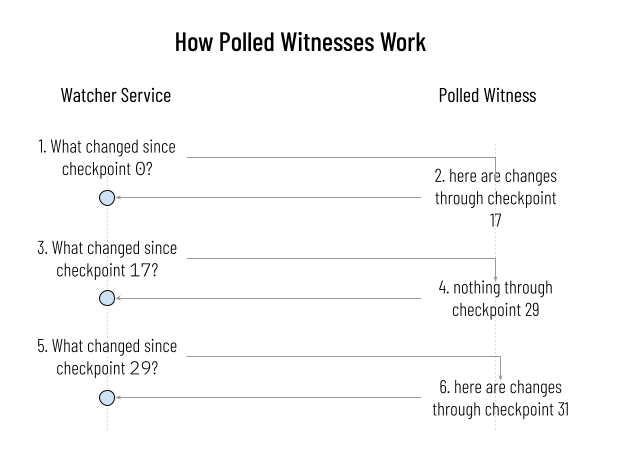
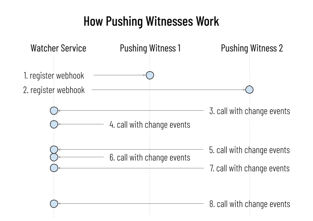

# KID0012 - Super Watchers

## Overview

This document describes a feature of the KERI ecosystem that has been referred to as "super watchers".

Watchers are already implemented; essentially, they are witnesses that do not directly record KEL and TEL events, but simply observe those events as recorded by other witnesses. Watchers typically observe the state of many AIDs (as reported by the AIDs' associated witnesses). Since we expect delegation and credential issuance and revocation events to be anchored to the KEL, watchers also observe these events. They do this to provide a consolidated and curated view. Watchers are a convenient way to centralize how state is *queried*, without actually centralizing how that state is *proved* or *trusted*. Because watchers observe events in many places, they are also an important mechanism for detecting and responding to duplicity.

An ordinary watcher has an enumeration of AIDs for which it observes events, and it may have a small set of stakeholders that depend upon it. A "super watcher" is a watcher with a much larger scope of concern. It is typically intended as a clearinghouse for information throughout an ecosystem, and it is configured with a dynamic scope that continually expands. For example, a watcher that attempts to watch all AIDs that issue or receive vLEIs — automatically adding new AIDs and their associated witnesses to its scope whenever new vLEIs are encountered — might be a super watcher.

We want super watchers to operate efficiently and interoperably in any KERI-oriented ecosystem, because they guarantee the rapid and accurate flow of information. We imagine that organizations with a big stake in an ecosystem's health will operate super watchers as a public good, in exchange for the benefits to their own reputation and their own customer experience.

## Desired End State

When the design described by this KID is implemented, the following things should be true about an ecosystem that has deployed super watchers:

1. It is practical for super watchers to watch millions of AIDs. Assuming modest rates of change in identifier state, and setting aside linear growth in storage requirements, this scale does not impose undue burden on witnesses or watchers, insofar as network chattiness, RAM, and other resources is concerned.
2. Super watchers can discover and watch all AIDs that may ever be serviced by particular witnesses, not just AIDs that have been explicitly enumerated to the super watchers.
3. For any AID within their intended scope, super watchers can give a high-quality answer to the question, "What is the latest known state of this AID?" Excluding the corner case of AIDs where all witnesses are offline, and at a scale of millions, it is possible to answer with a worst case latency of less than 2 minutes, typical latency of less than 1 minute, and for large sets of high-value watched AIDs, focused latency of less than 10 seconds.
4. Controllers of an AID can drive latency of their AID's state down in super watcher results by using witnesses that are known to have particularly efficient relationships with super watchers.
5. For any given AID that is watched by more than one super watcher, queries about state generally yield the same information, no matter which super watcher is queried. (It is understood that super watchers are eventually consistent, so if they have substantially different latency, there could be differences. Differences will also occur in cases of duplicity. Statistically, however, both of these situations should be corner cases.)
6. New AIDs that fall within the intended remit of the super watcher appear in the super watcher's data automatically. No special alerting by the AID controller, other than communication with the AIDs witnesses, is required.
7. New witnesses can be added to the ecosystem, and old witnesses can be retired, without any special coordination with super watchers. The super watchers will dynamically adjust to witness changes.
8. If there is duplicity, super watchers detect and report it within 2 minutes of its manifestation in diverged witness state.

## Requirements

9. Witnesses MUST implement an endpoint that describes which of the following features they support, so that their behavior is discoverable. (Or should the TEL of the witness simply contain a commitment to support certain features?)

10. Witnesses SHOULD support an efficient, comprehensive polling feature required by super watchers. Essentially, super watchers will ask, "What changes have you recorded since your &lt;checkpoint X&gt;?", and witnesses implementing the feature MUST respond with a batch of changes.

    

    This is probably implemented by having witnesses rotate to a new "current checkpoint ID" once every minute. All changes that the witness records in the next minute are associated with that new checkpoint ID. The witness maintains a circular index of the associations between changes and checkpoints for at least 2 hours (120 checkpoints).

    Witnesses SHOULD also support a variation on this polling request that constrains the AIDs of interest: "What changes have you recorded since your &lt;checkpoint X&gt;, for the following AIDs: {AID1, AID2, AID3...}?"

11. Witnesses SHOULD throttle polling requests.

12. Witnesses MAY also restrict who can poll. Exactly how they do this is out of scope. One obvious way to restric is by requiring polling requests to be signed by an AID on an allow list.

13. Witnesses MAY support a push notification feature as well. If they do, they allow themselves to be configured so that they push notifications of changes in the KEL/TEL of any of their serviced AIDs to an arbirary endpoint (a super watcher).

The super watcher benefits because it learns of changes with lower latency and greater efficiency than it would if it polled. However, the witness accepts a burden to provide this feature. For this reason, witnesses will probably only allow the feature if the watcher in question belongs to the same or an allied owner.

14. If witnesses support this push feature, they SHOULD push to only one location, delivery SHOULD be best-effort, and witnesses SHOULD contain no retry logic or state tracking. This preserves the simplicity of witnesses, and their focus on recording data, not moving it.

15. If witnesses support this push feature, they SHOULD also support aggregate push. This is a network optimization, where updates that occur within a configurable timeframe (e.g., 10 seconds) are all pushed as a single notification.

16. Duplicity detection. A watcher that detects duplicity MUST immediately notify all witnesses for the associated AID, and witnesses MUST expose an endpoint to receive such reports. (What else should be done to react to duplicity?)

17. A witness MUST expose an endpoint that announces any watchers that poll it, so the watcher's reputations can be computed.

18. A witness MUST expose an endpoint that announces if it is pushing to a watcher, so the watcher's reputation can be computed.

 

